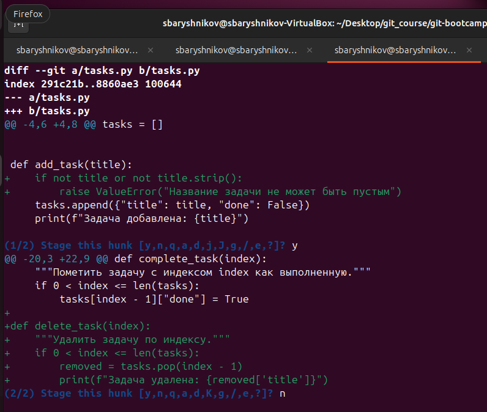
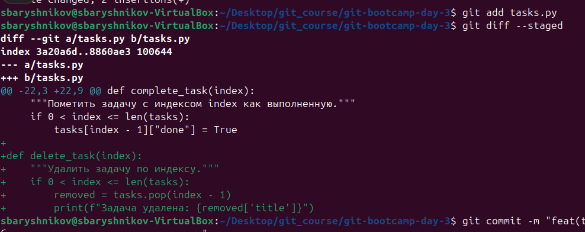
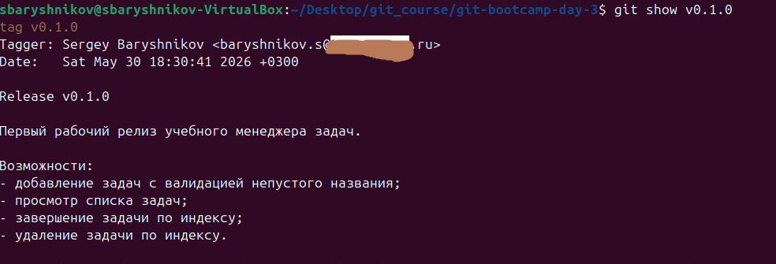
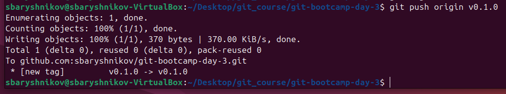
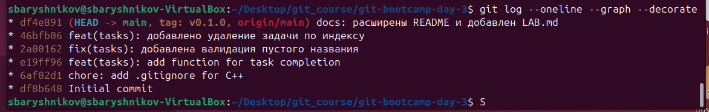

# LAB — день 3

Отчёт о выполнении домашнего задания дня 3 в рамках курса ["Интенсив по погружению в GIT"](https://slurm.io/git-intensive): построение реальной истории на ветке `main` с использованием Conventional Commits, разделение изменений через `git add -p` и публикация релиза через annotated тег `v0.1.0`.

## Содержание

- [LAB — день 3](#lab--день-3)
  - [Содержание](#содержание)
  - [Шаг 1. Initial commit](#шаг-1-initial-commit)
  - [Шаг 2. chore: .gitignore](#шаг-2-chore-gitignore)
  - [Шаг 3. feat(tasks): complete\_task](#шаг-3-feattasks-complete_task)
  - [Шаг 4. fix(tasks): валидация через add -p](#шаг-4-fixtasks-валидация-через-add--p)
  - [Шаг 5. feat(tasks): delete\_task](#шаг-5-feattasks-delete_task)
  - [Шаг 6. docs: расширенный README и LAB](#шаг-6-docs-расширенный-readme-и-lab)
  - [Релиз: тег v0.1.0](#релиз-тег-v010)
  - [Почему именно v0.1.0](#почему-именно-v010)
  - [Финальная история](#финальная-история)

## Шаг 1. Initial commit

Положили файлы `tasks.py` и `README.md`, первый коммит оставлен без префикса, потому что это исторически сложившееся исключение.

## Шаг 2. chore: .gitignore

Взяли стек C++, файл сгенерирован с использованием toptal-генератор

## Шаг 3. feat(tasks): complete_task

 Добавлена функция complete_task, новая функциональность обозначатся типом `feat` и входит в scope `tasks`, потому что относится к приложению `tasks`

## Шаг 4. fix(tasks): валидация через add -p

Два не связанных изменения в начале и в конце файла. При добавлении `git add -p` Git предложил подтвердить их добавление отдельно. Первый hunk был подтверждён к добавлению, второй отклонён.

Скриншот интерактивной сессии `git add -p`:



## Шаг 5. feat(tasks): delete_task

Оставшийся hunk закоммитили обычным `git add`. Перед коммитом проверили `git diff --staged`

Скриншот `git diff --staged` перед коммитом:



## Шаг 6. docs: расширенный README и LAB

`README.md` был дополнен с помощью нейронки по заданному описанию (перечисленные элементы файла). Файл `LAB.md` был взят из образца к занятию и исправлен . Этот коммит сделали без `-m`, через редактор, с телом ≥ 2 строк.]

## Релиз: тег v0.1.0

После шага 6 запушили `main`, поставили annotated тег и запушили его:

```bash
git push origin main
git tag -a v0.1.0      # многострочное сообщение через редактор
git push origin v0.1.0
```

Скриншот вывода `git show v0.1.0` (видно `tag` объект, автора, сообщение):



Скриншот публикации тега (`git push origin v0.1.0` или страница Releases/Tags на GitHub):



## Почему именно v0.1.0

- Версии 0.x.y используются для начального этапа разработки. Проект находится в статусе «учебного» с минимальным набором функций.
- Для перехода на на `v1.0.0` необходимо добавить функции удаления (delete_task), редактирования (edit_task) и отметки о выполнении (complete_task), и реализовать обработку ошибок - программа не должна падать, если пользователь ввел некорректные данные

Тег annotated выбран, потому что GitHub показывает в Releases только annotated, в annotated есть автор/дата/сообщение релиза.

## Финальная история

Скриншот ниже сделан **сразу после `git push origin v0.1.0`**, до того как был добавлен этот же `LAB.md` со скриншотами. На нём видно 6 коммитов; на последнем — `HEAD -> main, tag: v0.1.0` (тег и HEAD на одном коммите):



После того как я закоммитил актуализацию `LAB.md` со ссылками на скрины 1/4/5, в репозитории появился 7-й коммит. Теперь `HEAD -> main` указывает на него, а тег `v0.1.0` остался на 6-м коммите — на том же, где и был в момент релиза. Тег не двигается за веткой — это и есть его свойство, которое отличает его от ветки.

```
$ git rev-parse v0.1.0; git rev-parse HEAD
6bd221084911c24858bce4cca26ddfbd99c3c52e
e5b244ba8a707b5fe776a7f4d44bd46c24a037c2
```
